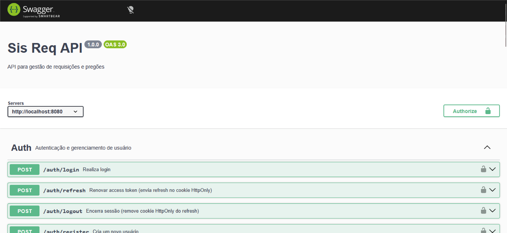
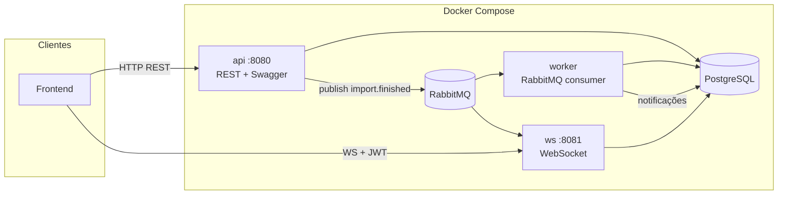
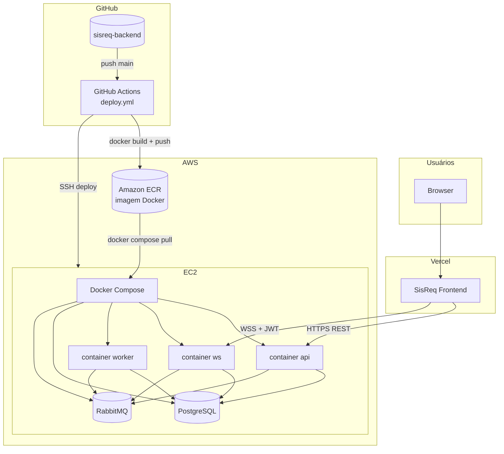
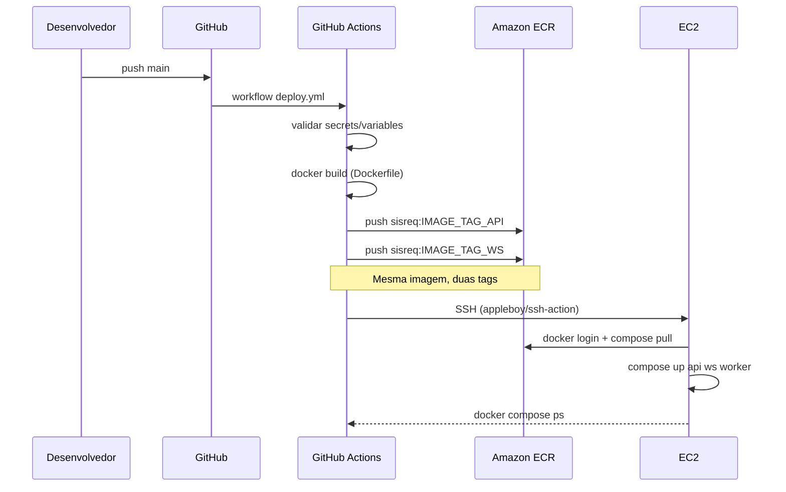
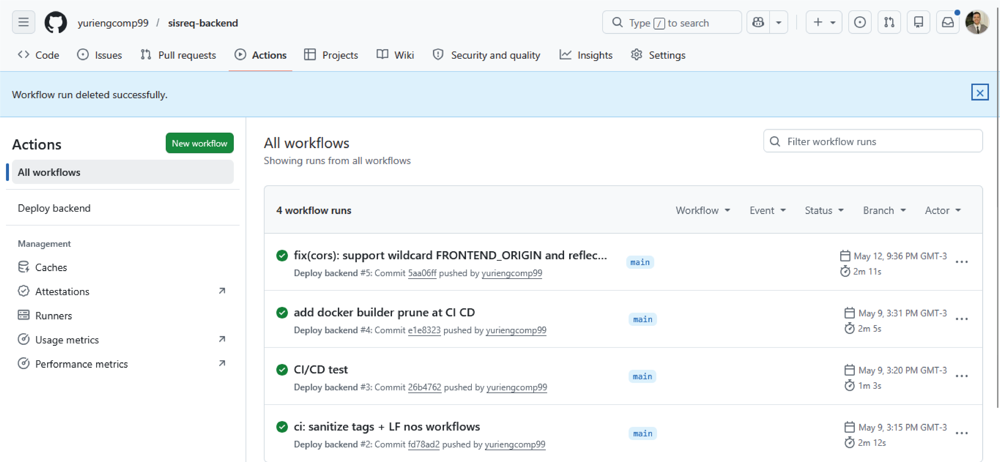
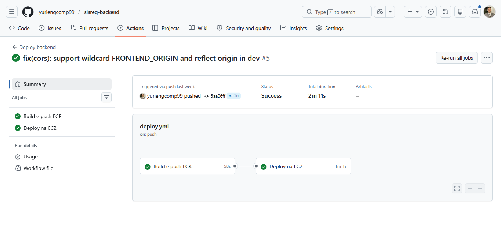
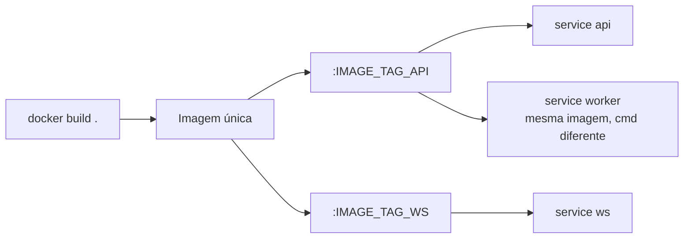

# SisReq — Backend API

> API REST em **Node.js + TypeScript** para gestão de **requisições de compras**, **atas de pregão**, **notas de crédito** e **capacidade de empenho** — com notificações em tempo real, filas assíncronas e deploy automatizado na AWS.

[](https://nodejs.org/)
[](https://www.typescriptlang.org/)
[](https://expressjs.com/)
[](https://www.postgresql.org/)
[](https://www.prisma.io/)
[](https://www.rabbitmq.com/)
[](https://docs.docker.com/compose/)
[](https://aws.amazon.com/)

**Demo:** [App (frontend)](https://sisreq.vercel.app/login)

<p align="center">
  <a href="https://sisreq.vercel.app/login">
    
  </a>
  <br />
  <sub>API documentada com Swagger (auth, pregões, requisições, notificações, etc.) — <code>/docs</code> em produção</sub>
</p>

---

## O que é

O **SisReq** é o backend de um sistema voltado ao fluxo de **compras públicas / licitações** (pregões, itens de ata, saldos, requisições formais e documentos oficiais). O foco deste repositório é entregar uma API **segura, documentada e preparada para produção**, com processos de background desacoplados e infraestrutura containerizada.

---

## Por que este projeto chama atenção

- **Arquitetura em camadas** — Controllers → Use Cases → Repositories, com **factories** para composição e testabilidade.
- **Micro-serviços leves no Docker** — API HTTP, WebSocket e worker RabbitMQ rodam em **containers separados**, cada um com responsabilidade única.
- **Mensageria com RabbitMQ** — Importação de planilhas dispara eventos; workers criam notificações sem bloquear a API.
- **Tempo real via WebSocket** — Contagem de notificações não lidas enviada ao cliente após eventos na fila.
- **Autenticação JWT** — Access token (Bearer) + refresh token em **cookie httpOnly**.
- **Documentação OpenAPI** — Swagger UI em `/docs` (rotas agrupadas por domínio, botão Authorize para JWT).
- **Geração de documentos** — Exportação de requisições em **DOCX** e **PDF** (`docx`, `pdf-lib`).
- **Importação Excel em lote** — Leitura com `xlsx`, processamento em chunks e publicação na fila.
- **CI/CD na AWS** — GitHub Actions faz build, push para **ECR** e deploy na **EC2** com `docker compose`.

---

## Arquitetura



| Serviço   | Porta (padrão) | Responsabilidade                                      |
|-----------|----------------|-------------------------------------------------------|
| `api`     | 8080           | REST, auth, regras de negócio, Swagger, migrations    |
| `ws`      | 8081           | Gateway WebSocket + consumer de notificações não lidas |
| `worker`  | —              | Consumer `import.finished` → notificações no banco      |
| `postgres`| 5432           | Persistência (Prisma)                                 |
| `rabbitmq`| 5672 / 15672   | Filas AMQP + painel de management                     |

---

## Arquitetura de deploy

Visão de como o código chega à produção: **GitHub Actions** constrói a imagem, publica no **Amazon ECR** e atualiza os containers na **EC2** via SSH + Docker Compose.

### Infraestrutura (produção)



### Pipeline CI/CD

Disparo: **push na branch `main`** ou **workflow_dispatch** (manual).

```mermaid
flowchart LR
  A[git push main] --> B[Job: build-and-push]
  B --> B1[Checkout código]
  B1 --> B2[Login AWS + ECR]
  B2 --> B3[docker build]
  B3 --> B4[Tag IMAGE_TAG_API<br/>e IMAGE_TAG_WS]
  B4 --> B5[docker push x2]
  B5 --> C[Job: deploy]
  C --> C1[SSH na EC2]
  C1 --> C2[aws ecr login]
  C2 --> C3[docker image prune]
  C3 --> C4[compose pull<br/>api ws worker]
  C4 --> C5[compose up -d<br/>--force-recreate]
  C5 --> D[Serviços em produção]
```





### Pipeline em produção (GitHub Actions)

Histórico de execuções do workflow **Deploy backend** na branch `main` (build + deploy com sucesso):



Detalhe de uma execução: job **Build e push ECR** (~58s) → **Deploy na EC2** (~1min), conforme `deploy.yml`:



### Imagens no ECR

Uma única build gera a imagem; duas tags apontam para o mesmo artefato (API e WS usam o mesmo `Dockerfile`; o **worker** reutiliza a imagem com outro `command` no Compose da EC2).



### Configuração no GitHub (sem segredos no repo)

| Tipo | Exemplos | Uso |
|------|----------|-----|
| **Variables** | `AWS_REGION`, `ECR_REPOSITORY`, `ECR_REGISTRY`, `IMAGE_TAG_API`, `IMAGE_TAG_WS`, `EC2_PROJECT_DIR` | Build, registry e caminho do projeto na EC2 |
| **Secrets** | `AWS_ACCESS_KEY_ID`, `AWS_SECRET_ACCESS_KEY`, `EC2_HOST`, `EC2_USER`, `EC2_SSH_KEY` | Credenciais AWS e acesso SSH |

Na EC2, a instância precisa de **IAM** (ou credenciais) com permissão de **pull no ECR**. O `docker-compose.yml` e o `.env` de produção ficam no servidor (`EC2_PROJECT_DIR`), fora do versionamento.

---

## Principais domínios da API

| Módulo            | Prefixo            | Descrição resumida                                      |
|-------------------|--------------------|---------------------------------------------------------|
| Autenticação      | `/auth`            | Login, refresh, registro, gestão de usuários (roles)    |
| Pregões / Atas    | `/pregoes`         | Consulta de itens, importação Excel de atas             |
| Requisições       | `/requisicoes`     | CRUD, emissão de documentos Word/PDF                    |
| Capacidade        | `/capacidade`      | Itens com saldo disponível para empenho                 |
| Nota de crédito   | `/nota-credito`    | Gestão de notas vinculadas às requisições               |
| Designações       | `/designation`     | Cargos / funções dos usuários                           |
| Notificações      | `/notifications`   | Listagem, leitura e contagem de não lidas                 |
| Dashboard         | `/dashboard`       | Resumo consolidado para o painel                        |

---

## Stack técnica

| Categoria        | Tecnologias                                              |
|------------------|----------------------------------------------------------|
| Runtime          | Node.js 20, TypeScript (ESM), `tsx`                      |
| HTTP             | Express 5, CORS, cookie-parser                           |
| Dados            | PostgreSQL 16, Prisma ORM                                |
| Mensageria       | RabbitMQ (`amqplib`)                                     |
| Tempo real       | `ws` (WebSocket)                                         |
| Segurança        | JWT, bcrypt, middleware de autorização por rota          |
| Arquivos         | Multer (upload), xlsx, docx, pdf-lib                     |
| Docs             | swagger-jsdoc, swagger-ui-express                        |
| Infra            | Docker, Docker Compose, GitHub Actions, AWS ECR/EC2     |

### Documentação da API

Rotas agrupadas por domínio, testáveis no navegador via **OpenAPI 3** (`swagger-jsdoc` + `swagger-ui-express`). Na captura acima: **Auth** (login, refresh com cookie HttpOnly, registro), além de pregões, requisições, notificações e dashboard — endpoint local `http://localhost:8080/docs` ou `/docs` na API em produção.

---

## Estrutura do projeto

```
src/
├── controllers/       # Camada HTTP (request/response)
├── use-cases/         # Regras de negócio
├── repositories/      # Acesso a dados (Prisma)
├── factories/         # Injeção de dependências por rota
├── modules/           # Módulos transversais (ex.: notificações)
├── routes/            # Definição de rotas Express
├── middlewares/       # Auth, validações
├── infra/queue/       # RabbitMQ (publishers, filas, conexão)
├── ws-gateway/        # WebSocket + consumers relacionados
├── worker/            # Processos background (CLI)
├── services/          # Geração de documentos, helpers
└── server.ts          # Bootstrap da API HTTP

prisma/                # Schema e migrations
.github/workflows/     # CI/CD (build ECR + deploy EC2)
docker-compose.yml     # Stack local e produção
```

---

## Como rodar

### Pré-requisitos

- [Docker](https://docs.docker.com/get-docker/) e Docker Compose
- (Opcional) Node.js 20+ para desenvolvimento sem container

### 1. Variáveis de ambiente

Crie um arquivo `.env` na raiz (usado pelo `docker-compose` e pelos serviços):

```env
# Banco
POSTGRES_USER=sisreq
POSTGRES_PASSWORD=sisreq
POSTGRES_DB=sisreq

# API
API_PORT=8080
NODE_ENV=production

# JWT (obrigatório)
JWT_ACCESS_SECRET=change-me-access
JWT_REFRESH_SECRET=change-me-refresh

# CORS — origens do frontend (vírgula ou espaço)
FRONTEND_ORIGIN=http://localhost:3000

#Informações PDF
REQUISICAO_DOC_FISCAL_NOME=Nome Fiscal Aqui
REQUISICAO_DOC_OD_NOME=Nome OD aqui

# WebSocket
WS_PORT=8081

# Opcional
SWAGGER_SERVER_URL=http://localhost:8080
```

No Docker, `DATABASE_URL` e `RABBITMQ_URL` são montados automaticamente pelo `docker-compose.yml`.

### 2. Subir o stack completo

```bash
docker compose up --build
```

| Endpoint              | URL                          |
|-----------------------|------------------------------|
| API                   | http://localhost:8080        |
| Swagger UI            | http://localhost:8080/docs   |
| WebSocket             | ws://localhost:8081          |
| RabbitMQ Management   | http://localhost:15672       |

### 3. Desenvolvimento local (sem Docker)

Em terminais separados:

```bash
npm install
npx prisma migrate dev
npm run dev                  # API :8080
npm run dev:ws-service       # WebSocket + consumer unread :8081
npm run worker:notificacoes  # Consumer import.finished
```

---

## Scripts úteis

| Comando                    | Descrição                          |
|----------------------------|------------------------------------|
| `npm run dev`              | API com hot-reload (`tsx watch`)   |
| `npm run dev:ws-service`   | Serviço WebSocket + Rabbit consumer |
| `npm run worker:notificacoes` | Worker de notificações pós-import |
| `npm run build`            | Compilação TypeScript              |
| `npm run start`            | API em produção                    |

---

## CI/CD

Workflow completo: [`.github/workflows/deploy.yml`](.github/workflows/deploy.yml).

| Etapa | O que acontece |
|-------|----------------|
| **Trigger** | Push em `main` ou execução manual (`workflow_dispatch`) |
| **build-and-push** | Build Docker → push no ECR com tags `IMAGE_TAG_API` e `IMAGE_TAG_WS` |
| **deploy** | SSH na EC2 → login ECR → `docker compose pull api ws worker` → `up -d --force-recreate` |

Diagramas e prints do pipeline: [Arquitetura de deploy](#arquitetura-de-deploy) (Mermaid + [lista de runs](docs/images/github-actions.png) + [detalhe do workflow](docs/images/github-actions-details.png)).

---

## Modelo de dados (visão geral)

Entidades principais no Prisma: **User**, **Designation**, **AtaItem**, **Requisicao**, **RequisicaoDetalhe**, **NotaCredito**, **Notification** — com enums para papéis (`ADMIN` / `USER`), tipo de empenho e flags sim/não.

---

## Contato

- **Autor:** [Yuri Rodrigues Cavalcanti](https://github.com/yuriengcomp99/)
- **LinkedIn:** [https://www.linkedin.com/in/yuri-rodrigues-895287307/](https://www.linkedin.com/in/yuri-rodrigues-895287307/)
- **Frontend:** [Frontend](https://sisreq.vercel.app/login)

---

<p align="center">
  <sub>Projeto desenvolvido com foco em código limpo, separação de responsabilidades e deploy reproduzível.</sub>
</p>
